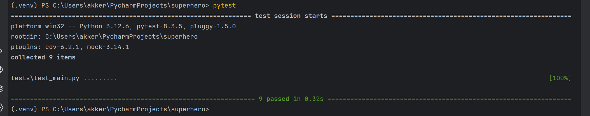

# Функция для получения самого высокого героя

## Описание

Функция принимает на вход 2 параметра - пол и наличие работы.
Затем идет на открытый ресурс https://akabab.github.io/superhero-api/ получает данные и из них ищет по критериям подходящего героя

## Тесты

Запустить все тесты разом можно через терминал, используя команды _pytest_ или _pytest -v_ 
для детального вывода
